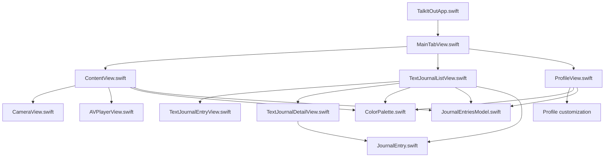

# TalkItOut

A calming, modern journaling app for iOS that supports audio and text entries, live camera preview, and profile customization.

---

## Table of Contents

- [Overview](#overview)
- [App Structure](#app-structure)
- [Authentication & Onboarding](#authentication--onboarding)
- [Audio Journal (Record Tab)](#audio-journal-record-tab)
- [Text Journal (Text Entry Tab)](#text-journal-text-entry-tab)
- [Profile (Profile Tab)](#profile-profile-tab)
- [Models & Data](#models--data)
- [Color & Theme](#color--theme)
- [Other Utilities](#other-utilities)
- [Supporting Files](#supporting-files)
- [File Relationships](#file-relationships)
- [Summary](#summary)

---

## Overview

TalkItOut is a journaling app that allows users to:
- Record audio and text journal entries
- View transcripts and playback audio
- Manage their profile and streaks
- Enjoy a calming, accessible UI

---

## App Structure

### `TalkItOutApp.swift`
- **Entry point** for the app.
- Sets up Firebase, onboarding, and authentication flow.
- Shows `MainTabView` after onboarding/authentication.

### `MainTabView.swift`
- **Main tab bar** controller.
- Tabs:
  - **Record:** Audio journal & camera
  - **Text Entry:** List/create/edit text journals
  - **Profile:** User profile & settings

---

## Authentication & Onboarding

### `AuthView.swift`
- Handles **email/password sign up and sign in**.

### `OnboardingView.swift`
- Animated, multi-page onboarding for new users.

---

## Audio Journal (Record Tab)

### `ContentView.swift`
- Main screen for **recording audio journal entries**.
- Features:
  - Live camera preview (`CameraView`)
  - Audio recording, live transcript, journaling prompts
  - Streaks and motivational messages

### `CameraView.swift`
- Shows a **live front camera preview** (works on real devices only).

### `AVPlayerView.swift`
- Plays back audio journal entries and shows transcripts.

---

## Text Journal (Text Entry Tab)

### `TextJournalListView.swift`
- Lists all text journal entries.
- Features:
  - Search and filter
  - Tap to view/edit
  - Add new entries

### `TextJournalEntryView.swift`
- Create a new text journal entry (title + main text).

### `TextJournalDetailView.swift`
- Shows details of a text journal entry.
- Allows editing of the entry.

---

## Profile (Profile Tab)

### `ProfileView.swift`
- Shows and edits user profile (display name, bio, profile picture).
- Displays journal entry history.

---

## Models & Data

### `JournalEntry.swift`
- Data model for journal entries:
  - `id`, `date`, `type` (audio/text), `title`, `text`, `audioURL`, `transcript`

### `JournalEntriesModel.swift` & `TextJournalEntriesModel`
- ObservableObject models holding arrays of journal entries.

---

## Color & Theme

### `ColorPalette.swift`
- Centralized color definitions for the app’s calming palette:
  - `deepCream` (main background)
  - `paleLavender` (cards/inputs)
  - `mutedTeal`/`skyBlue` (accents)
  - `deepCharcoal` (text)
  - ...and more

---

## Other Utilities

### `SentimentAnalyzer.swift`
- Analyzes the sentiment of journal entries.

### `OpenAIService.swift`
- (If used) Connects to OpenAI for journaling prompts or transcript analysis.

---

## Supporting Files

- **`Info.plist`**: App configuration, permissions (camera, microphone, etc.)
- **`Assets.xcassets`**: App icons and color assets

---

## File Relationships

---

## Summary

- **Top-level:** `TalkItOutApp.swift` → `MainTabView`
- **Tabs:** Record (audio/camera), Text Entry (list/create/edit), Profile
- **Models:** `JournalEntry`, `JournalEntriesModel`
- **UI:** Calming, modern color palette
- **Camera:** Works on real devices
- **Authentication:** Email/password
- **Onboarding:** Animated, multi-page

---

> For more details, see the code comments in each file or reach out to the maintainer.
